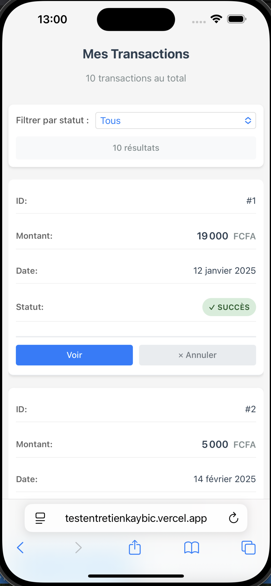
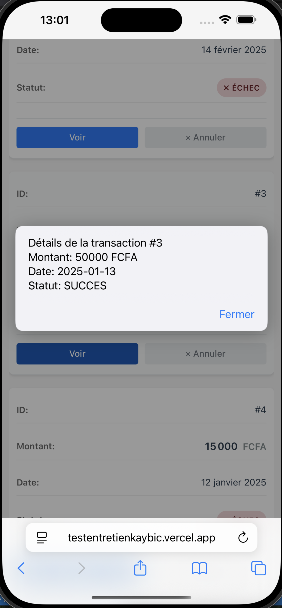
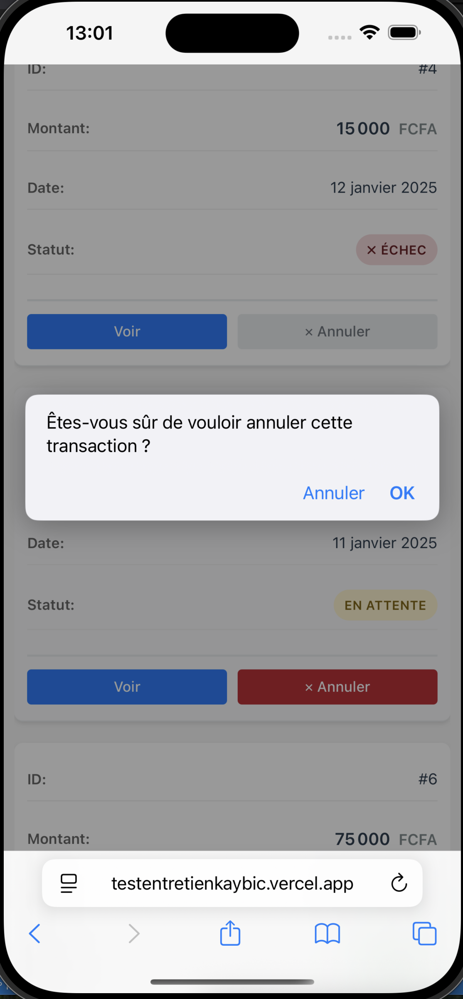

# Test 1 - Interface de Gestion de Transactions

## Description
Interface web responsive affichant une liste de transactions avec statuts et actions.

## Technologies
- React / Next.js 16
- JavaScript (ES6+)
- CSS3

## Fonctionnalités
- Affichage de la liste des transactions
- Filtrage par statut (Tous, Succès, En attente, Échec)
- Badges colorés selon le statut
- Actions : Voir détails et Annuler
- Design responsive (mobile, tablette, desktop)
- Annulation conditionnelle (uniquement transactions "En attente")

##  Installation

\`\`\`bash
npm install
npm run dev
\`\`\`

Ouvrir [http://localhost:3000](http://localhost:3000)

##  Structure du projet

\`\`\`
src/
├── app/
│   ├── page.tsx          # Point d'entrée
│   └── globals.css       # Styles globaux
├── pages/
│   └── PageTransactions.jsx
├── composants/
│   ├── ListeTransactions.jsx
│   ├── LigneTransaction.jsx
│   ├── BadgeStatut.jsx
│   └── ActionsTransaction.jsx
└── donnees/
    └── transactionsMock.js
\`\`\`

## Captures d'écran

### Desktop

### Mobile

